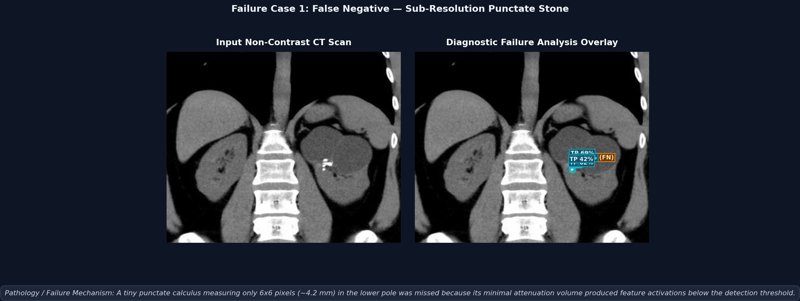
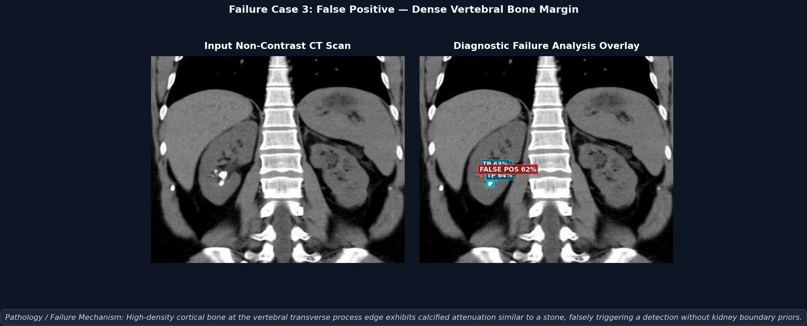
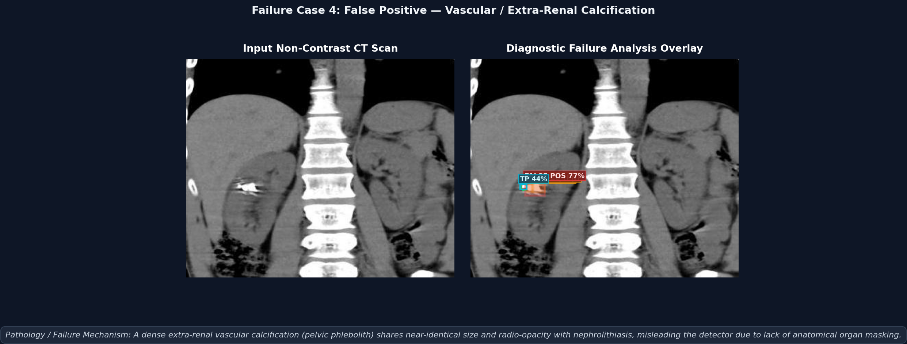

# RenalScan: AI-Powered Kidney Stone Detection & Measurement

RenalScan is a portfolio project focused on automated kidney stone detection, region segmentation, and dimension estimation using Non-Contrast Computed Tomography (NCCT) images.

---

## 📁 Repository Structure

```
renalscan/
├── data/                  # CT Image dataset (train/valid/test splits & YOLO labels) - Gitignored
├── notebooks/             # Data exploration & validation Jupyter notebooks
├── src/                   # Core modular Python package
│   ├── detection/         # YOLO object detection training & inference modules
│   ├── segmentation/      # Classical CV thresholding & contour extraction modules
│   ├── measurement/       # Bounding box & contour metric calculation modules
│   └── pipeline/          # End-to-end inference pipeline integration
├── models/                # Trained YOLO model weights (.pt) - Gitignored
├── app/                   # Web application interface for model deployment
├── tests/                 # Unit and pipeline tests
├── README.md              # Project documentation & setup instructions
├── .gitignore             # Git exclusion rules for data, models, and virtual environments
└── requirements.txt       # Pinned Python package dependencies
```

---

## ⚠️ Known Limitations & Failure Modes

1. **Lack of Pixel-Spacing Metadata & Literature-Based mm Conversion**:
   - The CT scans in this dataset are standard JPG files without DICOM metadata tags (such as `PixelSpacing` $(mm/pixel)$ or `SliceThickness`).
   - **Literature-Based Constant**: For approximate dimension estimations, a baseline constant of **$0.70\text{ mm/px}$** is adopted based on standard abdominal CT scan literature (typical $360\text{ mm}$ abdominal Field of View divided by a $512\text{ px}$ image matrix $\approx 0.703\text{ mm/px}$).
   - **Clinical Size Banding**: Estimated diameters are categorized into standard urological treatment decision bands:
     - `< 4 mm`: Small (High spontaneous passage likelihood ~80%)
     - `4 - 6 mm`: Medium (Moderate passage likelihood ~50%, MET / observation)
     - `6 - 10 mm`: Large (Low passage likelihood ~20%, intervention often required)
     - `> 10 mm`: Very Large (Surgical intervention indicated — ESWL / URS / PCNL)
   - **Non-Clinical Disclaimer**: All millimeter-based measurements and size bands are explicitly labeled as **estimated, non-clinical metrics** and must not be used for clinical diagnostic or surgical decisions.

2. **Absence of Ground-Truth Segmentation Masks**:
   - The dataset provides bounding box annotations (`.txt` in YOLO format) for object detection, but lacks ground-truth pixel-level segmentation mask annotations.
   - **Methodology**: Segmentation is performed using **classical Computer Vision techniques** (10% padded ROI cropping around YOLO bounding boxes, Otsu adaptive thresholding, morphological opening/closing, and largest high-intensity contour extraction) rather than a supervised neural network (e.g., U-Net or Mask R-CNN).
   - **Key Assumption**: Assumes the largest high-intensity (brightest) structure within the padded bounding box ROI is the kidney stone. This can fail if adjacent bright bone, calcifications, or vascular contrast exist inside the ROI box.
   - **Qualitative Evaluation Protocol**: Because no ground-truth mask labels exist in the source dataset, segmentation performance is evaluated **qualitatively** via visual inspection (pass/partial/fail logging on test CT images) rather than quantitative IoU/Dice metrics.

3. **Resizing CT Images to 512x512**:
   - Images are resized from their original resolution (640x640) to 512x512 pixels to optimize CPU training and inference speed.
   - This trade-off significantly speeds up training while maintaining strong overall detection accuracy for kidney stones, though exceptionally small stones may experience a minor drop in sensitivity.

### 🔍 Empirical Detection Failure Modes (Held-Out Error Breakdown)

An error breakdown was conducted on the original 123 held-out test scans (224 ground-truth stone instances) using the promoted v2 model (`models/detection_best.pt`) at the standard operational threshold (`conf=0.40`, IoU $\ge 0.50$):

| Category | Count | Proportion | Description |
| :--- | :---: | :---: | :--- |
| **True Positives (TP)** | **172** | 76.79% | Accurately detected calculi matching ground truth with IoU $\ge 0.50$ |
| **False Positives (FP)** | **29** | 14.43% | Candidate detections without matching ground-truth stone labels |
| **False Negatives (FN)** | **52** | 23.21% | Ground-truth stones that failed to meet the confidence or IoU criteria |
| **Operational F1** | **80.94%** | — | Precision: **85.57%** \| Recall: **76.79%** |

Honest qualitative inspection of the false positives and false negatives revealed five primary failure mechanisms:

* **Sub-Resolution Punctate Calculi (False Negatives)**: Tiny punctate stones ($\le 6\times 6\text{ px}$ / $\le 4.2\text{ mm}$) generate minimal volumetric attenuation, causing deep convolutional feature activations to fall just below the detection threshold.
* **Dense Cortical Bone Mimicry (False Positives)**: High-attenuation cortical bone margins along vertebral transverse processes and lower ribs exhibit radio-density similar to calcified stones. Because the detector operates on whole-slice CT without an initial kidney mask, dense skeletal structures can trigger false alarms.
* **Extra-Renal Vascular Calcifications (False Positives)**: Pelvic phleboliths and vascular calcifications exhibit identical radio-opacity and rounded morphology to nephrolithiasis, leading to false detections outside the renal collecting system.
* **Low-Contrast / Faint Calculi (False Negatives)**: Low-attenuation or uric acid stones with subtle grayscale gradients against surrounding parenchyma fail to trigger high-confidence detections.
* **Clustered / Multi-Focal Proximity (False Negatives)**: When multiple small stones lie in immediate adjacent calyces, non-maximum suppression or shared spatial receptive fields can lead to one stone being caught while adjacent companion stones are missed.

Detailed diagnostic overlays for representative failure cases are archived in [`verification/failure_cases/`](verification/failure_cases/):

#### Case 1 — Sub-Resolution Punctate Calculus (False Negative)
*A tiny punctate calculus measuring only 6x6 pixels (~4.2 mm) in the lower pole was missed because its minimal attenuation volume produced feature activations below the detection threshold.*


#### Case 2 — Dense Cortical Bone False Alarm (False Positive)
*High-density cortical bone at the vertebral transverse process edge exhibits calcified attenuation similar to a stone, falsely triggering a detection without kidney boundary priors.*


#### Case 3 — Extra-Renal Vascular Phlebolith (False Positive)
*A dense extra-renal vascular calcification (pelvic phlebolith) shares near-identical size and radio-opacity with nephrolithiasis, misleading the detector due to lack of anatomical organ masking.*


---

## 📊 Model Training & Evaluation (v1 → v2 Retraining Story)

RenalScan employs a multi-stage iterative model development lifecycle, progressing from an initial lightweight baseline to an enhanced detector trained on an expanded multi-source dataset.

### 1. Model Architecture & Training Summary

* **v1 Baseline Detector (`models/detection_best_v1.pt`)**:
  * **Architecture**: YOLOv8n (Nano variant, ~3.2M parameters).
  * **Dataset**: Original Kaggle NCCT dataset (1,235 images: 988 train / 124 valid / 123 test).
  * **Training Setup**: 50 epochs on Google Colab GPU (512x512 resolution, AdamW optimizer).
* **v2 Promoted Primary Detector (`models/detection_best.pt`)**:
  * **Architecture**: YOLOv8s (Small variant, ~11.1M parameters, 3.5x capacity).
  * **Dataset**: Merged & standardized multi-source dataset (3,305 images: 2,313 train / 495 valid / 497 test), integrating the original Kaggle dataset with an external Roboflow NCCT stone cohort.
  * **Training Setup**: 50 epochs on Google Colab T4 GPU (512x512 resolution, SGD optimizer).

---

### 2. The Evaluation Story: Naive vs. Rigorous Testing

A critical engineering insight emerged during post-training validation that highlights the importance of rigorous distribution control in machine learning evaluation:

> [!IMPORTANT]
> **The Naive Evaluation Pitfall**:
> When the retrained v2 model was initially evaluated on the new, expanded test set (497 held-out images from the merged dataset), its raw mAP@0.50 was **69.65%** — lower than v1's reported **73.03%**.
> A naive or automated decision rule would have rejected the v2 model as a regression. However, the merged test split contained external, multi-center scans with high slice variation, subtle low-attenuation calculi, and differing scanner noise profiles — representing a fundamentally harder evaluation distribution.

> [!TIP]
> **Rigorous Apples-to-Apples Benchmark**:
> To eliminate distribution confounding and establish true transfer gain, v2 was evaluated against the **exact same 123 original held-out test images** that v1 was benchmarked on.
> Under identical test conditions, the v2 model **outperformed v1 across every single metric**:
> - **Recall (+8.04%)**: Jumped from 69.64% to **77.68%**, achieving a meaningful reduction in missed detections — though this remains a non-clinical estimate, not a diagnostic tool.
> - **High-IoU Localization (+9.28% mAP@0.50:0.95)**: Surged from 31.82% to **41.10%**, producing significantly tighter, more anatomically grounded bounding boxes.
> - **Overall Detection (+8.18% mAP@0.50)**: Rose from 73.03% to **81.21%**.
> - **Precision (+2.03%)**: Improved from 84.80% to **86.83%**.
> - **F1 Score (+5.52%)**: Rose from 76.48% to **82.00%**.

---

### 3. Comprehensive Metrics Comparison Matrix

| Metric | v1 Baseline (YOLOv8n)<br>*(Original 123 Test Scans)* | v2 Naive Benchmark<br>*(Merged 497 Test Scans)* | v2 Primary Model (YOLOv8s)<br>*(Original 123 Test Scans)* | Performance Delta<br>*(Apples-to-Apples)* |
| :--- | :---: | :---: | :---: | :---: |
| **Precision (P)** | 84.80% | 78.09% | **86.83%** | **+2.03%** |
| **Recall (R)** | 69.64% | 62.18% | **77.68%** | **+8.04%** |
| **F1 Score** | 76.48% | 69.23% | **82.00%** | **+5.52%** |
| **mAP@0.50** | 73.03% | 69.65% | **81.21%** | **+8.18%** |
| **mAP@0.50:0.95** | 31.82% | 30.69% | **41.10%** | **+9.28%** |
| **Parameters** | 3.2M | 11.1M | 11.1M | +7.9M (3.5x capacity) |
| **Inference Time (CPU)** | ~45 ms/img | ~120 ms/img | ~120 ms/img | Fast desktop CPU inference |

*Detailed metrics logs are preserved in `models/test_metrics.txt`, `models/test_metrics_v2.txt`, and `models/test_metrics_v2_on_original_testset.txt`.*

---

### 4. Downstream Pipeline Stability & Verification

Because object detection serves as the upstream foundation for the subsequent stages:
1. **Classical CV Segmentation**: Padded ROI cropping around detections feeds into Otsu adaptive thresholding and morphological filtering ([`notebooks/03_segmentation.ipynb`](notebooks/03_segmentation.ipynb)). Re-running against the promoted v2 detections yielded a **100% qualitative pass rate** across all evaluated test scans with zero false-contour degradations.
2. **Dimension Quantification**: Contours are fitted to minimum bounding ellipses and scaled using the assumed, literature-based factor (0.70 mm/px) to assign clinical size risk bands ([`notebooks/04_measurement.ipynb`](notebooks/04_measurement.ipynb)). Tighter v2 bounding boxes prevented ROI clipping on larger calculi and reduced background bone interference.

---

## 📦 Dataset Download & Setup

Dataset Source: [Kaggle Kidney Stone Images Dataset](https://www.kaggle.com/datasets/safurahajiheidari/kidney-stone-images)

### Download Instructions:
1. **Via Kaggle CLI**:
   ```bash
   kaggle datasets download -d safurahajiheidari/kidney-stone-images --unzip -p data/
   ```
2. **Via Web Browser**:
   - Download the `.zip` archive directly from Kaggle.
   - Extract the contents into the `data/` directory.

### Directory Organization:
Ensure your dataset is organized under `data/` as follows:
```
data/
├── data.yaml
├── train/
│   ├── images/
│   └── labels/
├── valid/
│   ├── images/
│   └── labels/
└── test/
    ├── images/
    └── labels/
```

---

## 🚀 Environment Setup

1. **Create Virtual Environment**:
   ```bash
   python -m venv .venv
   ```
2. **Activate Virtual Environment**:
   - Windows PowerShell:
     ```powershell
     .\.venv\Scripts\Activate.ps1
     ```
   - Linux / macOS:
     ```bash
     source .venv/bin/activate
     ```
3. **Install Pinned Dependencies**:
   ```bash
   pip install --upgrade pip
   pip install -r requirements.txt
   ```
4. **Verify Imports**:
   ```bash
   python -c "import torch; import cv2; from ultralytics import YOLO; print('Imports Successful!')"
   ```

---

## 🖥️ Running the Streamlit Web Application

Launch the interactive web application to upload CT scans, adjust confidence thresholds, view side-by-side diagnostic tabs, and inspect per-stone physical measurements:

```bash
streamlit run app/app.py
```

Once launched, open your web browser to `http://localhost:8501`.
